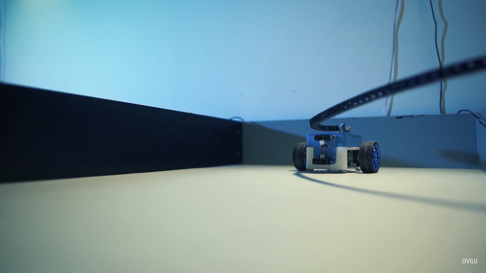

<!--
author:   André Dietrich, Sebastian Zug

email:    andre.dietrich@ovgu.de

version:  0.0.2

language: en

narrator: US English Female

comment:  Presentation for the e-Learning-2019 conference.

import:   https://raw.githubusercontent.com/liaScript/rextester_template/master/README.md
          https://raw.githubusercontent.com/liaScript/processing_template/master/README.md

script:   https://cdn.jsdelivr.net/chartist.js/latest/chartist.min.js
link:     https://cdn.jsdelivr.net/chartist.js/latest/chartist.min.css

@Chartist
<div class="ct-chart ct-golden-section" id="chart@0">
</div>
<script>
  $.getScript("https://cdn.jsdelivr.net/chartist.js/latest/chartist.min.js", function(){
    let x = new Chartist.Line('#chart@0', {@1});
  });
</script>

@end

@red: <b style="color: red"> @0</b>

-->

# LiaScript: A Domain-Specific-Language for Interactive Online Courses

> __1.__ Use the arrow buttons above for navigation
>
> __2.__ Turn on your sound for the text output.

See this project on:

* GitHub: https://github.com/andre-dietrich/e-Learning-2019
* LiaScript: https://liascript.github.io/course/?https://raw.githubusercontent.com/andre-dietrich/e-Learning-2019/master/README.md#1

LiaScript is an attempt to enable everyone to create free and interactive online
courses, without the need of being an experienced programmer. Instead, it aims
to bring both parties, software- and course-developers, closer together by
introducing Open-Source techniques into the Open-courSe development process.
LiaScript was designed to be compatible to Common-Markdown, but it introduces
lots of language extensions that deal with quizzes, surveys, ASCII-art,
text2speech, animations, online programming, the integration of JavaScript, etc.
as well as its own macro-system that simplifies tedious and repetitive tasks. It
comes along with its own Just-In-Time compiler that runs in the Browser and
therefor does not require additional tooling.

## 1. Introduction

                             --{{0}}--
LiaScript was initially developed within the _"Industrial eLab-Project [^1]"_,
which aims to make university hardware and laboratories accessible via the
Internet. But, we soon realized that only by giving remote access to these
resources via a fancy website we will run into problems. Our mobile
Arduino-Bots could be used to teach programming, sensing, navigation, dive into
operating systems or even to apply artificial intelligence. Thus, the real
problem was to develop an extendable and adaptable system for creating courses
(instead of a single Web-App) with different objectives and for students with
different backgrounds.

                              {{0-1}}
<!-- width="100%" -->

                             --{{1}}--
Surely, creating an online-course from scratch requires a lot of expertise in
different web technologies at front-end (e.g., HTML, JavaScript, CSS, testing),
back-end (e.g., webservers, databases), and different communication standards to
connect both sides (e.g., CRUD, WebSockets, AJAX). Hence, it is nearly
impossible for a non-programmer to understand all of these issues, before
starting to develop his or her own online course.

                              {{1-2}}
<!-- width="100%" -->


                             --{{2}}--
Screen- or pod-casts are not a real alternative, since they are expensive and
time-consuming in production, not easy to change or translate, and require
additional skills in movie cutting. That is why platforms such as
[Udacity](https://eu.udacity.com) or [Coursea](https://www.coursera.org) invest
a lot of effort and money in high-quality course productions, which is
comparable to movie productions, including screenplays, actors, different sets
and locations. Fortunately, there are so called Learing Management Systems (LMS)
[(Dobre, 2015)](#19 "Learning Management Systems for higher education-an overview of available options for Higher Education Organizations")
that try to ease the course development.


                             --{{3}}--
But how is such a kind of "simplicity" achieved? Mostly, by offering integrated
configuration-systems, editors and authoring-tools, that shall enable the user
to create a course with a lot of buttons and menus, sub-sub-menus, and masks,
whose only purpose is to hide the non-intuitive syntax and semantics of a
language that can be easily interpreted machines, not by humans.


                               {{3}}
> We should instead start to create languages that can be easy understood and
> applied by humans, in order to describe their intentions, and let the
> machine rack its CPU in order to find an appropriate translation.

[^1]: Project-site: http://www.elab.ovgu.de

## 2. Adapting Open-Source Development

                             --{{0}}--
More or less, all the aforementioned systems have drawbacks in some of the
following points:

**Requirements from an Open-Source perspective**

1. No support for larger course developer-teams, including those who develop
   additional functionality and those who provide content
2. No versioning, in contrast to Wikipedia as a single source of truth, content
   shall be provided in different "styles" for heterogeneous groups of students
3. No re-usability, parts of one course cannot simply be applied of copied into
   another project
4. No support for internationalization/localization (i18n), thus a course cannot
   simply be translated into another language
5. No variance in representation
6. Difficulties in adopting and integrating new web technologies


                             --{{1}}--
Pin-points 1 and 2 can be easily solved by applying a purely text-based approach
for the course development and version control systems[^3]
[(Zhou et al. 2018)](#19 "A collaborative and open solution for large‐scale online learning").
All required resources, including images, videos, data-sheets, JavaScript and
CSS-styles, and everything else can be easily uploaded and made available via
the internet.

[^3]: E.g. [Git](https://git-scm.com) and its web-based hosting services
      [GitHub](https://github.com) or [GitLab](https://gitlab.com).

### 2.1 Why Markdown?

                             --{{0}}--
Markdown [(Wikipedia, 2019)](#19 "Markdown") is a simple meta-markup language
used to structure and annotate simple text documents. Its goal is to keep the
source text easy to read and write, that is why it has become more or less the
standard documentation-format for Open-Source projects. Originally, it was
developed to write HTML content efficiently, without having to use a WYSIWYG[^2]
editor. Directly writing a markup language such as HTML is considered too error
prone and annoying for the writing process. Of course, we are not the first ones
that apply Markdown to ship educational contents, earlier examples are:

* __[GitBook](https://www.gitbook.com)/[Pandoc](https://pandoc.org)__:
  free Markdown parser that have been widely applied in OER generation
  [(Ovadia, 2019)](#19 "Addressing the Technical Challenges of Open Educational Resources")
* __[elearn-js](https://github.com/elb-min-uhh/markdown-elearnjs)__:
  converter for Markdown documents into responsive OER websites, which allows
  integrating quizzes, interactive images, videos, etc.
  [(Heinecke, 2016)](#19 "Produktion digitaler Skripte")
* __[Iodide](https://alpha.iodide.io)__:
  [Jupyter Notebooks](https://jupyter.org) brought to the internet, next to OER
  it can be interpreted as an example of literate programming


                             --{{1}}--
Of course there are other approaches that have to be mentioned
[(McKiernan, 2017)](#19 "Imagining the 'open' university: Sharing scholarship to improve research and education"),
but the commonality of all system is that it's about creating static documents,
which, although it is translated into a more beautiful format, still have to be
read. To our knowledge, our approach is the only one that deals with the
creation of interactive presentations, which are still generated from simple and
static Markdown documents.

[^2]: Stands for: _What You See Is What You Get_

### 2.2 What is LiaScript?

                             --{{0}}--
In contrast to other Markdown compilers that generate static HTML, LiaScript is
an interpreter that downloads and renders the original Markdown document
directly within the browser. That means, if the document is updated, the
resulting representation will be updated too. Thus, there is no need for
additional tooling, compiling steps, or server-side support. LiaScript was
implemented from scratch with Elm[^3] for efficiency and speed, which includes
its own parser and run-time environment.

* Online interpreter, that runs directly within the browser
* Written in Elm[^3]
* Support for different representation styles
  (see [Sec. 2.3.5](#11 "Output Modes"))
* New Markdown language features:
  _Quizzes_, _Coding_, _Animations_, _Multimedia_, _ASCII-art_, ...

                             --{{1}}--
One of our design goals was to support different rendering modes, which covers
the traditional textbook mode, next to presentations with animations and spoken
text. Furthermore, we extended the language itself with various features, that
should transform Markdown from a traditionally static markup approach into
something new, suitable for interactive online courses and more.


[^3]: Elm is a functional programming language that compiles to JavaScript,
      see the project-website: https://elm-lang.org


### 2.3 Extensions to Markdown

> __Why does Markdown only support static content?__
>
> We came a long way from written scrolls to printed books to electronic books,
> which can still be printed out or copied by hand! But, actually it is the same
> old format that has been brought to a new device. Although a computer and the
> Internet give us much more opportunities for visualization, interaction, an
> story telling ...


#### 2.3.1 Multimedia

                             --{{0}}--
Markdown supports 2 types of links (onto internal and external resources), which
can be either direct or formatted:


                              {{0-1}}
*******************************************************************************

__Markdown-Code: (Reference)__

``` markdown
* Direct reference:
  https://LiaScript.github.io

* Formatted reference:
  [Link to LiaScript](https://LiaScript.github.io)
```

__Result:__

* Direct reference:
  https://LiaScript.github.io

* Formatted reference:
  [Link to LiaScript](https://LiaScript.github.io)

**********************************************************

                             --{{1}}--
Images can be included via formatted references that start with an exclamation
mark:

                              {{1-2}}
*******************************************************************************

__Markdown-Code: (Image)__

``` markdown
 <!--width="100%"-->
```

__Result:__

<!--
  width="100%"
-->

*******************************************************************************

                             --{{2}}--
In contrast to this, it is still complicated to include multimedia content.
Based on the previous notation, it is possible in LiaScript to mark a link as an
audio-file by adding a starting question-mark, which can be interpreted as an
ear.

                              {{2-3}}
*******************************************************************************

__LiaScript-Code: (Audio)__

``` markdown
?[Joy to the world](http://www.orangefreesounds.com/wp-content/uploads/2018/11/Joy-to-the-world-song.mp3?_=1)
```

__Result:__

?[Joy to the world](http://www.orangefreesounds.com/wp-content/uploads/2018/11/Joy-to-the-world-song.mp3?_=1)

*******************************************************************************

                             --{{3}}--
Due to the combination of images and sound, it is possible to insert videos. One
of the benefits that lays in this notation is that every common Markdown-viewer
will still generate a fully working link to these resources.

                              {{3-4}}
*******************************************************************************

__LiaScript-Code: (Video)__

``` markdown
!?[The eLab-Project on YouTube](https://www.youtube.com/watch?v=bICfKRyKTwE)<!--
width="560px"
height="315px"
-->
```

__Result:__

!?[The eLab-Project on YouTube](https://www.youtube.com/watch?v=bICfKRyKTwE)<!--width="560px" height="315px"-->

*******************************************************************************

                             --{{4}}--
You might probably have noticed, that some examples contain HTML-comments with
additional annotations. This is a cheap way of formatting any kind of elements,
such as text, images, tables, videos, etc. A starting comment defines the format
of the entire block, whereby a trailing comment changes the format of its
predecessor only.


                               {{4}}
*******************************************************************************

__LiaScript-Code: (Annotations)__

``` markdown
<!--style="color: red"-->
This whole paragraph will be colored in red ;-)<!--
class="animated infinite bounce"
style="animation-delay: 3s;"
-->, but only this smiley is going to start jumping
after 3 seconds.
```

__Result:__

<!--style="color: red"-->
This whole paragraph will be colored in red ;-)<!--
class="animated infinite bounce"
style="animation-delay: 3s;"
-->, but only this smiley is going to start jumping
after 3 seconds.


*******************************************************************************

                             --{{5}}--
This way it is even possible to define complex animation-sequences, while the
content remains readable with another Markdown-viewer, since they tend to ignore
comments.

#### 2.3.2 ASCII-Art 1

                             --{{0}}--
From our experience, we know that a lot of produced images represent simple
diagrams that represent functions, signal waves, trends, etc. These have to be
generated with Excel, Gnuplot, Matlab or other tools, and to be exported, which
makes it also difficult to change them or to translate labels. LiaScript offers
the opportunity to draw diagrams directly within the document. Such diagrams can
be easily adapted and it is not necessary to switch to another "tool".


``` HTML
                         Title and axes are optional
    1.9 |    DotS
        |                 ***
      y |               *     *
      - | r r r r r r r*r r r r*r r r r r r r
      a |             *         *
      x |            *           *
      i | B B B B B * B B B B B B * B B B B B
      s |         *                 *
        | *  * *                       * *  *
        +------------------------------------
        0              x-axis               1
```

                             --{{1}}--
This is turned into a nicely rendered diagram, wherein the color and the size of
dots is defined by the original characters.


        <!--style="max-width: 720px"-->
                         Title and axes are optional
    1.9 |    DotS
        |                 ***
      y |               *     *
      - | r r r r r r r*r r r r*r r r r r r r
      a |             *         *
      x |            *           *
      i | B B B B B * B B B B B B * B B B B B
      s |         *                 *
        | *  * *                       * *  *
        +------------------------------------
        0              x-axis               1


#### 2.3.3 ASCII-Art 2

                             --{{0}}--
If necessary, it is also possible to depict complex issues, such as graphs,
UML-diagrams, or even pictures with the help of simple characters.

``` HTML
                           .--->  F
  A       B     C   D     /
  *-------*-----*---*----*----->  E
           \            ^ \
            v          /   '--->  G
             B --> C -'
```

<!-- style="display: block; margin-left: auto; margin-right: auto; max-width: 315px;" -->
`````````````````````````````````````
                           .--->  F
  A       B     C   D     /
  *-------*-----*---*----*----->  E
           \            ^ \
            v          /   '--->  G
             B --> C -'
`````````````````````````````````````

                             --{{1}}--
Additionally, it is also possible to use any kind of Unicode-character. Thus,
LiaScript has support for Chinese, Greek, Arabic, or any other kind of
characters and symbols.

                               {{1}}
*******************************************************************

```
  ┌─┬┐  ╔═╦╗  ╓─╥╖  ╒═╤╕
  │ ││  ║ ║║  ║ ║║  │ ││
  ├─┼┤  ╠═╬╣  ╟─╫╢  ╞═╪╡
  └─┴┘  ╚═╩╝  ╙─╨╜  ╘═╧╛
  ┌───────────────────┐
  │  ╔═══╗ Some Text  │▒
  │  ╚═╦═╝ in the box │▒
  ╞═╤══╩══╤═══════════╡▒
  │ ├──┬──┤           │▒
  │ └──┴──┘           │▒
  └───────────────────┘▒
   ▒▒▒▒▒▒▒▒▒▒▒▒▒▒▒▒▒▒▒▒▒
```

<!-- style="display: block; margin-left: auto; margin-right: auto; max-width: 315px;" -->
````````````````````````````````
  ┌─┬┐  ╔═╦╗  ╓─╥╖  ╒═╤╕
  │ ││  ║ ║║  ║ ║║  │ ││
  ├─┼┤  ╠═╬╣  ╟─╫╢  ╞═╪╡
  └─┴┘  ╚═╩╝  ╙─╨╜  ╘═╧╛
  ┌───────────────────┐
  │  ╔═══╗ Some Text  │▒
  │  ╚═╦═╝ in the box │▒
  ╞═╤══╩══╤═══════════╡▒
  │ ├──┬──┤           │▒
  │ └──┴──┘           │▒
  └───────────────────┘▒
   ▒▒▒▒▒▒▒▒▒▒▒▒▒▒▒▒▒▒▒▒▒
````````````````````````````````

*******************************************************************


#### 2.3.4 Quizzes

                              --{{0}}--
One of the language feature we wanted at most, was an easy way to integrate
quizzes in different flavors and thus, to give learners the possibility to check
their knowledge. Quizzes are always associate with double brackets, such that to
add a text quiz, you only have to enter the solution in double braces and the
input field, check-, and resolve-buttons are generated automatically.


                               {{0-1}}
*******************************************************************************

``` markdown Text-Quiz
What did the **fish** say when he hit a **concrete wall**?

      [[dam]]
```

What did the **fish** say when he hit a **concrete wall**?

      [[dam]]

*******************************************************************************

                               --{{1}}--
Some might adapt the question to handle the ambiguity in this case. But let us
try out what LiaScript has to offer. It is either possible to add hints, by
adding question-marks in double brackets and let the user decide if he needs
help, by clicking onto the associated button in the rendered course. The
optional `script`-tag allows to check the input, in this case to trim it and to
transform it lower-case and finally to compare it with different possible
solution. Therefor the `@input`-macro gets replaced by the current user input.
The trailing Markdown-blocks surrounded by two lines of stars show a more
detailed explanation, which appears either if the user input was correct or if
the user clicked onto the resolve button.

                                {{1-2}}
*******************************************************************************

``` markdown Text-Quiz #2
What did the **fish** say when he hit a **concrete wall**?

[[dam]]
[[?]]   Do not take this question serious.
[[?]]   It is actually a joke in lower-case.
[[?]]   Fishes cannot realy speak.
<script>
  let input = "@input".trim().toLowerCase();
  input == "damn" || input == "dam";
</script>
******************************************************

A __dam__ is a barrier obstructing flowing water and
__damn__ usually refers to damnation, a condemnation,
usually by a god.

$$
   \sum_{i=1}^\infty\frac{1}{n^2}
        =\frac{\pi^2}{6}
$$

******************************************************
```

What did the **fish** say when he hit a **concrete wall**?

    [[dam]]
    [[?]]   Do not take this question serious.
    [[?]]   It is actually a joke in lower-case.
    [[?]]   Fishes cannot realy speak.
    <script>
      let input = "@input".trim().toLowerCase();
      input == "damn" || input == "dam";
    </script>
    ******************************************************

    A __dam__ is a barrier obstructing flowing water and
    __damn__ usually refers to damnation, a condemnation,
    usually by a god.

    $$
       \sum_{i=1}^\infty\frac{1}{n^2}
            =\frac{\pi^2}{6}
    $$

    ******************************************************

*******************************************************************************


                               --{{3}}--
A single-choice quiz is defined by stylized radio buttons, where the `X` marks
the right solution and only one line is allowed to contain the `X` contain.
Extensions with hints, solutions, or JavaScript checks can also be applied.


                                {{3-4}}
*******************************************************************************

``` markdown Single-Choice-Quiz
**What is the only correct option?**

[( )] Option 1
[( )] Option 2
[(X)] Option 3
[( )] Option 4
```

---

**What is the only correct option?**

[( )] Option 1
[( )] Option 2
[(X)] Option 3
[( )] Option 4

*******************************************************************************

                               --{{3}}--
How would you encode a multiple-choice quiz with a typewriter, probably
similarly as we did it. It looks like a list of simple check-buttons that
define the solution. You can add as much rows/options and of course add also
hints, scripts, or an explanation...


                                {{2-3}}
*******************************************************************************

``` markdown Multiple-Choice-Quiz
Just add as many points as you wish:

    [[X]] Only the **X** marks the correct point.
    [[ ]] Empty ones are wrong.
    [[X]] ...
```

Just add as many points as you wish:

    [[X]] Only the **X** marks the correct point.
    [[ ]] Empty ones are wrong.
    [[X]] ...

*******************************************************************************

                               --{{5}}--
A generic quiz can be defined with the help of an exclamation-mark in double
brackets and a `script`-tag. In this case a random-number is used to generate
the outcome. Additional HTML-elements might be required to define different
input possibilities.


                                 {{5}}
*******************************************************************************

``` markdown Generic-Quiz
[[!]]
<script>
  // you are free to check anything you want
  if(Math.random() < 0.2)
    true;
  else
    false;
</script>
```

    [[!]]
    <script>
      // you are free to check anything you want
      if(Math.random() < 0.2)
        true;
      else
        false;
    </script>

*******************************************************************************


#### 2.3.5 Output Modes

                               --{{0}}--
In the following two parts are intended to explain, how a section can be divided
into several fragments and how speech output can be generated.


                                {{0-1}}
<!-- width="100%" -->

                               --{{1}}--
If you are using the online rendered version of this course at LiaScript
website, then you will probably have noticed that there is a button in the upper
right corner. It allows switching between three different display modes. The
user can decide, if he or she rather wants to listen to the explanatory text as
in a presentation or to read it like a book.

                                 {{1}}
1. Presentation (with voice output)
2. Slides (with notes ...)
3. Textbook (without fragmentation and voice output)


##### 2.3.5.1 Fragmentation

                               --{{0}}--
Defining fragments and revealing them step by step is quite simple, only a
number in double braces has to be put in front of a Markdown-block. Fragments
with only one number will sustain until the end of a slide. A point of
disappearance can be defined by putting a minus and a second number into double
braces. Inline fragments can be defined by putting the fragment number and the
elements to appear into successive braces. And it is also possible to attach
different blocks to the same fragment number, either by attaching a number to
every block or by putting them into a body of stars, as it was done with the
solution in [Sec. 2.3.4](#10 "Quizzes").

``` markdown
                  {{1}}
This text will appear at {3}{__inline is also possible__}first.


{{2-4}} This block will appear afterwards and
disappear at step number 4.

I am here to the end of slide ...

{{4}} I come at last.
```

                  {{1}}
This text will appear at {3}{__inline is also possible__}first.


{{2-4}} This block will appear afterwards and
disappear at step number 4.

I am here to the end of slide ...

{{4}} I come at last.


##### 2.3.5.2 Voice Output

                               --{{0}}--
Voice output is implemented with the help of
[ResponsiveVoice](http://responsivevoice.org). Within an initial `comment`-tag
at the beginning of the document, it is possible to define the default voice for
a course. This voice can be changed at every section as well as within every
voice comment itself. Such comments are treated as extended fragments, which are
used to explain certain fragments in more detail. Therefor, they are defined
similar to block-fragments surrounded by minuses. Depending on the presentation
mode, these texts are either displayed within the slide or read out loud. This
way it is also possible to implement a dialog between different persons.


``` markdown
<!--
..
narrator: US English Female
-->

# Title 1

              --{{1}}--
This text is spoken by a female.


     --{{2 UK English Male}}--
I should speak with a UK like accent.

     --{{3 Russian Female}}--
Я говорю по-русски с женским голосом.
```

                             --{{1}}--
This text is spoken by a female.


                      --{{2 UK English Male}}--
I should speak with a UK like accent.

                       --{{3 Russian Female}}--
Я говорю по-русски с женским голосом.


### 2.4 Extending LiaScript

                               --{{0}}--
In the previous sections we had presented syntactic extensions to Markdown. But
the Internet is full libraries and possibilities that a might be necessary for a
particular course or topic. In contrast to many other Markdown-interpreters
LiaScript allows integrating JavaScript, HTML, and CSS directly within the
document. Additionally, it has support for a macro-notation that allows
automating and thus simplify repetitive and tedious tasks.

<!-- width="100%"-->

#### 2.4.1 ... with JavaScript and HTML

                               --{{0}}--
It is possible use HTML everywhere and if you want to make use of a certain
JavaScript library or CSS-file, their URLs have to be included in the main
comment-tag at first. Using the keyword `script` followed by a colon and a URL
or multiple URLs, JavaScript can be integrated and similarly by using the
keyword `link` style-sheets can be loaded.

``` html
<!--
script: https://ajax.googleapis.com/ajax/libs/jquery/1.11.3/jquery.min.js
        https://cdn.jsdelivr.net/chartist.js/latest/chartist.min.js

link:   https://cdn.jsdelivr.net/chartist.js/latest/chartist.min.css
-->
```

                               --{{1}}--
Afterwards it is possible everywhere to access the new functionality. The
following example depicts, how the JavaScript library
[Chartist](https://gionkunz.github.io/chartist-js/) is used to plot a certain
graph.

                                 {{1}}
``` html
<div class="ct-chart ct-golden-section" id="chart">
</div>

<script>
  let chart = new Chartist.Line('#chart', {
    labels: [1, 2, 3, 4],
    series: [[100, 120, 180, 200]]
  });
</script>
```

                               --{{2}}--
And this is the resulting graph rendered by Chartist ...

                                 {{2}}
<div class="ct-chart ct-golden-section" id="chart"></div>
<script>
  $.getScript("https://cdn.jsdelivr.net/chartist.js/latest/chartist.min.js", function(){
    let chart = new Chartist.Line('#chart', {
      labels: [1, 2, 3, 4],
      series: [[100, 120, 180, 200]]
  })});
</script>

#### 2.4.2 ... with Macros


                               --{{0}}--
In [Sec. 2.3.4](#10 "Quizzes"), the `@input` macro has already been used to mark
the replacement for the user input. A macro always starts with an `@` symbol and
can be defined in the "main" comment of a document. Macros describe simple rules
for text replacement. For the one-line `@red` macro, everything following the
colon defines the replacement text. Parameter substitutions are defined by a `@`
symbol followed by a number.


                                {{0-2}}
``` html
<!--
...
@red: <b style="color: red"> @0</b>
...
-->
```

                               --{{1}}--
These extensions can then be used arbitrarily in the document, as shown in the
following example.

                                {{1-2}}
*******************************************************************************

``` markdown
> This is a block-citation contains
> a @red(very important) example...
```

---

> This is a block-citation contains
> a @red(very important) example...

*******************************************************************************

                               --{{2}}--
A macro can also call other macros, and more complex macros can be defined as a
block consisting of multiple HTML, Markdown, or JavaScript elements. In this
example the use of Chartist should be simplified by changing the ID for the
`div` element and the content to be drawn is passed as the second parameter.

                                 {{2}}
``` html
<!--
...
@Chartist
<div class="ct-chart ct-golden-section" id="chart@0">
</div>
<script>
  let chart = new Chartist.Line('#chart@0', {@1});
</script>

@end
...
-->
```

                               --{{3}}--
This macro can also be called via a "function-like" notation. Since commas are
used as separators for the parameters, back-ticks must be used here to pass the
second parameter as an entire string. Admittedly, for very long entries, this
can quickly become unreadable.

                                {{3-4}}
*******************************************************************************

``` markdown
@Chartist(id1,`labels: [1,2,3], series: [[1,3,1]]`)
```

---

@Chartist(id1,`labels: [1,2,3], series: [[1,3,1]]`)

*******************************************************************************

                               --{{4}}--
For this reason, macros can also be called within a code-block, therefor only
the respective macro must be called in the head of the block. The body of the
block is then passed as a single parameter. This makes it easier to define
complex macros and additionally, all popular Markdown-viewers should at least
display this kind of inputs in a nicely rendered code-block with syntax
highlighting, which enables the interpretation of data.


                                 {{4}}
*******************************************************************************

```` markdown
```json @Chartist(id2)
labels: [1, 2, 3, 4, 5, 6, 7],
series: [
  [100, 120, 180, 200, 0, 12, -1],
  [10, 20, 30, 40, 50, 90, -100]]
```
````

---

```json @Chartist(id2)
labels: [1, 2, 3, 4, 5, 6, 7],
series: [
  [100, 120, 180, 200, 0, 12, -1],
  [10, 20, 30, 40, 50, 90, -100]]
```

*******************************************************************************


### 2.4 Executable Code

                               --{{0}}--
The following syntax can be used to combine several Markdown code-blocks into
one project. To the different files titles can be associated, and they can be
opened and closed. The additional `script` tag at the end identifies these
blocks as executable code and defines how to handle the contents of each block.
In this case the `@input` macro is called with a parameter, which defines which
code-block gets substituted at this position.


                                {{0-1}}
```` markdown
``` js     -EvalScript.js
let who = data.first_name + " " + data.last_name;

if(data.online) {
  who + " is online"; }
else {
  who + " is NOT online"; }
```
``` json    +Data.json
{
  "first_name" :  "Sammy",
  "last_name"  :  "Shark",
  "online"     :  true
}
```
<script>
  // insert the JSON dataset into the local variable data
  let data = @input(1);

  // eval the script that uses this dataset
  eval(`@input(0)`);
</script>
````

                               --{{1}}--
The LiaScript interpretation of these blocks then looks like this. All files are
editable and a linear version management system is used to track changes. Try
it, change the code and go back to earlier versions.


                                {{1-2}}
``` js     -EvalScript.js
let who = data.first_name + " " + data.last_name;

if(data.online) {
  who + " is online"; }
else {
  who + " is NOT online"; }
```
``` json    +Data.json
{
  "first_name" :  "Sammy",
  "last_name"  :  "Shark",
  "online"     :  true
}
```
<script>
  // insert the JSON dataset into the local variable data
  let data = @input(1);

  // eval the script that uses this dataset
  eval(`@input(0)`);
</script>


                               --{{2}}--
As shown in [Sec. 2.3](#13 "Extending LiaScript"), it is also possible to
integrate different JavaScript functionalities and libraries, so that also
different programming languages can be supported. The example below shows a
simple _C_ program that can be compiled and executed using the
[rextester API](https://rextester.com/main). The more complex definition of the
associated `script`-tag was provided using the `@Rextester.eval` macro. Only by
attaching such a macro, any code block can be turned into an executable one.


                                {{2-3}}
``` c source_file.c
#include <stdio.h>
int main()
{
  int i; // Try to delete the semicolon
         // to see what happens next...

  for(i=0; i<10; ++i) {
    printf("Hello, World! #% d\n", i);
  }
  return 0;
}
```
@Rextester.C(true)


                               --{{3}}--
The combination with other languages and visualizations (using HTML and
JavaScript) is also possible, see the interactive example for the programming
language [_Processing_](https://de.wikipedia.org/wiki/Processing):

                                 {{3}}
``` cpp ABSTRACT01js
int num,cnt,px,py,fadeInterval;
Particle[] particles;
boolean initialised=false,doClear=false;
float lastRelease=-1,scMod,fadeAmount;

void setup() {
  size(400,300);
  background(255);
  smooth();
  rectMode(CENTER_DIAMETER);
  ellipseMode(CENTER_DIAMETER);

  cnt=0;
  num=150;
  particles=new Particle[num];
  for(int i=0; i<num; i++) particles[i]=new Particle();

  reinit();
  px=-1;
  py=-1;
}

void draw() {
  if(doClear) {
    background(255);
    doClear=false;
  }

  noStroke();

  if(frameCount%fadeInterval==0) {
    fill(255,255,255, fadeAmount);
    rect(width/2,height/2, width,height);
  }  

  updateAuto();

  for(int i=0; i<num; i++)
    if(particles[i].age>0) particles[i].update();
}

void reinit() {
  doClear=true;
  scMod=random(1,1.4);
  fadeInterval=(int)random(220,300);
  fadeAmount=random(30,60);
//  println("fadeInterval "+fadeInterval+" scMod "+nf(scMod,0,3)+
//    " fadeAmount "+nf(fadeAmount,0,3));
  for(int i=0; i<num; i++) particles[i].age=-1;
  initAuto();
}

void mousePressed() {
  reinit();
}

AutoMover auto[];
int autoN;

void initAuto() {
  autoN=(int)random(3,6);
//  println("initAuto "+autoN);
  auto=new AutoMover[autoN];
  for(int i=0; i<autoN; i++) auto[i]=new AutoMover();

}

void updateAuto() {
  for(int i=0; i<autoN; i++) auto[i].update();
}

class AutoMover {
  Vec2D pos,posOld;
  float dir,dirD,speed,sc,dirCnt;
  int type,age,ageGoal,interval;

  AutoMover() {
    reinit();
  }

  void reinit() {
    ageGoal=(int)random(150,350);
    if(random(100)>95) ageGoal*=1.25;
    age=-(int)random(50,150);    
    pos=new Vec2D(random(width-100)+50,random(height-100)+50);

    dir=(int)random(36)*10;
    type=0;
    if(random(100)>60) type=1;

    interval=(int)random(2,5);    
    if(type==1) {
      interval=1;
      dir=degrees(atan2(-(pos.y-height/2),pos.x-width/2));
    }

    dirD=random(1,2);
    if(random(100)<50) dirD=-dirD;
    speed=random(3,6);

    sc=random(0.5,1);
    if(random(100)>90) sc=random(1.2,1.6);
    dirCnt=random(20,35);

    if(type==0) {
      if(random(100)>95) sc=random(1.5,2.25);
      else sc=random(0.8,1.2);
    }
    sc*=scMod;
    speed*=sc;
  }

  void update() {
    age++;
    if(age<0) return;
    else if(age>ageGoal) reinit();
    else {
      if(type==1) {
        pos.add(
          cos(radians(dir))*speed,sin(radians(dir))*speed);

        dir+=dirD;
        dirD+=random(-0.2,0.2);
        dirCnt--;
        if(dirCnt<0) {
          dirD=random(1,5);
          if(random(100)<50) dirD=-dirD;
          dirCnt=random(20,35);
        }
      }
      if(age%interval==0) newParticle();   
      if(pos.x<-50 || pos.x>width+50 ||
        pos.y<-50 || pos.y>height+50) reinit();
    }
  }

  void newParticle() {
    int partNum,i;

    if(type==0) dir=int(random(36))*10;

    i=0;
    while(i<num) {
      if(particles[i].age<1) {
        float offs=random(30,90);
        if(random(100)>50) offs=-offs;
        particles[i].init(dir+offs,pos.x,pos.y,sc);

        break;
      }
      i++;
    }

    px=mouseX;
    py=mouseY;
  }
}

class Particle {
  Vec2D v,vD;
  float dir,dirMod,speed,sc;
  int col,age,stateCnt;
  int type;

  Particle() {
    v=new Vec2D(0,0);
    vD=new Vec2D(0,0);
    age=0;
  }

  void init(float _dir,float mx,float my,float _sc) {
    dir=_dir;
    sc=_sc;

    float prob=random(100);
    if(prob<80) age=15+int(random(30));
    else if(prob<99) age=45+int(random(50));
    else age=100+int(random(100));

    if(random(100)<80) speed=random(2)+0.5;
    else speed=random(2)+2;

    if(random(100)<80) dirMod=20;
    else dirMod=60;

    v.set(mx,my);
    initMove();
    dir=_dir;
    stateCnt=10;
    if(random(100)>50) col=0;
    else col=1;

    type=(int)random(30000)%2;
  }

  void initMove() {
    if(random(100)>50) dirMod=-dirMod;
    dir+=dirMod;

    vD.set(speed,0);
    vD.rotate(radians(dir+90));

    stateCnt=10+int(random(5));
    if(random(100)>90) stateCnt+=30;
  }

  void update() {
    age--;

    if(age>=30) {
      vD.rotate(radians(1));
      vD.mult(1.01f);
    }

    v.add(vD);
    if(col==0) fill(255-age,0,100,150);
    else fill(100,200-(age/2),255-age,150);

    if(type==1) {
      if(col==0) fill(255-age,100,0,150);
      else fill(255,200-(age/2),0,150);
    }

    pushMatrix();
    scale(sc);
    translate(v.x,v.y);
    rotate(radians(dir));
    rect(0,0,1,16);
    popMatrix();

    if(age==0) {
      if(random(100)>50) fill(200,0,0,200);
      else fill(00,200,255,200);
      float size=2+random(4);
      if(random(100)>95) size+=5;
      size*=sc;
      ellipse(v.x*sc,v.y*sc,size,size);
    }
    if(v.x<0 || v.x>width || v.y<0 || v.y>height) age=0;

    if(age<30) {
      stateCnt--;
      if(stateCnt==0) {
        initMove();
      }
    }
   }

}

// General vector class for 2D vectors
class Vec2D {
  float x,y;

  Vec2D(float _x,float _y) {
    x=_x;
    y=_y;
  }

  Vec2D(Vec2D v) {
    x=v.x;
    y=v.y;
  }

  void set(float _x,float _y) {
    x=_x;
    y=_y;
  }

  void set(Vec2D v) {
    x=v.x;
    y=v.y;
  }

  void add(float _x,float _y) {
    x+=_x;
    y+=_y;
  }

  void add(Vec2D v) {
    x+=v.x;
    y+=v.y;
  }

  void sub(float _x,float _y) {
    x-=_x;
    y-=_y;
  }

  void sub(Vec2D v) {
    x-=v.x;
    y-=v.y;
  }

  void mult(float m) {
    x*=m;
    y*=m;
  }

  void div(float m) {
    x/=m;
    y/=m;
  }

  float length() {
    return sqrt(x*x+y*y);
  }

  float angle() {
    return atan2(y,x);
  }

  void normalise() {
    float l=length();
    if(l!=0) {
      x/=l;
      y/=l;
    }
  }

  Vec2D tangent() {
    return new Vec2D(-y,x);
  }

  void rotate(float val) {
    // Due to float not being precise enough, double is used for the calculations
    double cosval=Math.cos(val);
    double sinval=Math.sin(val);
    double tmpx=x*cosval - y*sinval;
    double tmpy=x*sinval + y*cosval;

    x=(float)tmpx;
    y=(float)tmpy;
  }
}
```
@Processing.eval


                                --{{4}}--
For such JavaScript libraries and also for the use of other functionalities, we
offer templates that have been implemented via our macro system[^4]. These
can be used freely and furthermore it also minimizes the breaks when reading the
original Markdown document.

[^4]: List of LiaScript templates:
      https://liascript.github.io/course/?https://raw.githubusercontent.com/liaScript/templates/master/README.md#1

## 3. Conclusion

                                --{{0}}--
Looking back onto [Sec. 2](#3 "Adapting Open-Source Development"), we did not
discuss points 3 to 6 so far. LiaScript was build around the idea of
course-development as Open-Source projects.

                                --{{1}}--
Thus, anything from one course can be used in another course, either by linking
directly onto a slide or by simply copy and pasting the required parts
(__req 3__). Furthermore, we offer a growing number of templates, which are
founded on our macro-system, that ease the usage and integration of new and
complex web technologies (__req 6__).

                                --{{2}}--
LiaScript currently supports three different styles of rendering modes (see
[Sec. 2.3.5](#11 "Output Modes")), allowing every user to choose his/her
preferred type (__req 5__). Concerning the preferred course language,
translating a single text-document is much easier than translating a whole
software-project or a YouTube-video or podcast and LiaScript offers some options
that allow to host different language versions of one course at the same project
(__req 4__).


                                  {{1}}
* (3.) Reusability --> anything can simply be copied into any course
* (6.) Integrating new web technologies --> via a macro-system and templates


                                  {{2}}
* (5.) Variance in representation -> three different modes
* (4.) Internationalization/localization (i18n) --> supported by specific header
       tags

## References

Dobre, Iuliana. (2015).
_Learning Management Systems for higher education-an overview of available options for Higher Education Organizations._
In: Procedia-Social and Behavioral Sciences 180, pp. 313-320.

Heinecke, Michael. (2016).
_Production digitaler Skripte._
[online] Available at: http://www.sumo.uni-hamburg.de/DigitaleSkripte/
URL [Accessed Date 26 Mar. 2019].

McKiernan, Erin C. (2017).
_Imagining the "open" university: Sharing scholarship to improve research and education._
In: PLoS biology, 15.10.

Ovadia, Steven. (2019).
_Addressing the Technical Challenges of Open Educational Resources._
In: Portal - Libraries and the Academy, 19.1, pp. 79-93.

Wikipedia contributors. (2019).
_Markdown._
[online] Available at:
https://en.wikipedia.org/wiki/Markdown
URL [Accessed Date 26 Mar. 2019].

Zhou, Qingguo, et al. (2018).
_A collaborative and open solution for large‐scale online learning._
In: Computer Applications in Engineering Education, 26.6, pp. 2266-2281.
